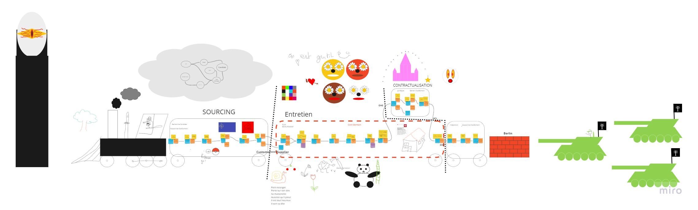

# Plannification Entretient Groupe 3 Nathan Bessa, Loïc Colat, Guillaume Dormoy, Christopher Malivert
## Bonne humeur
+ Qu'est ce qui est rouge et mauvais pour les dents ? -> Une brique.
+ Qu'est ce qui est rouge et sent la peinture bleue ? -> La peinture rouge.
+ Pourquoi les T-rex ne peuvent pas applaudir ? -> Car ils sont éteint.
+ Si je me frappe et que j'ai mal, suis-je trop fort ou trop faible ?
+ Si j'envoi un colis à mon frère, peut on appeler ça un Bro-Colis ?
+ Qu'est ce qui est blanc et qui ne sait pas monter aux arbres ? -> Un réfrigirateur.

## Gherkin Scenario
GIVEN the candidate **Robert** is available for a meeting the **14/05/2020** 
  AND I have a list of rooms
  AND I have a list of consultant
  
WHEN I plannify the technical meeting with **Robert**

THEN the system should create a meeting with **Robert**
  AND in a room available the **14/05/2020**
  AND with a consultant with the appropriates skills available the **14/05/2020**

## Miro link
[Board Miro](https://miro.com/app/board/o9J_ksxeOx8=/) 

